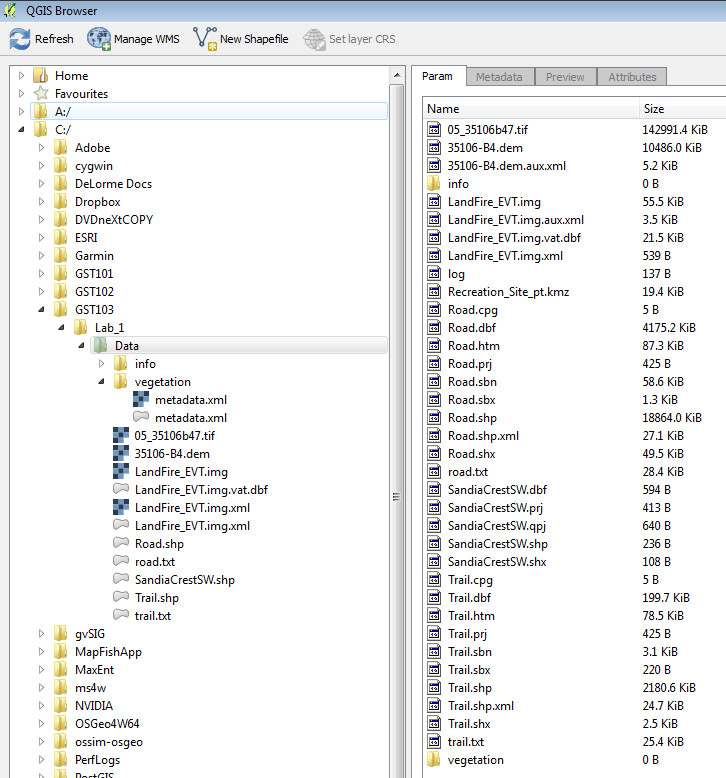
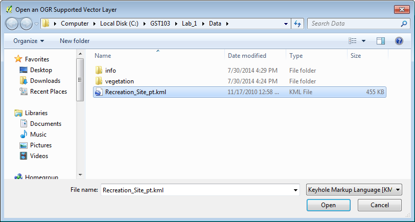

# GST 103: Data Acquisition and Management 
## Lab 1 - Reviewing the Basics of Geospatial Data
### Objective – Explore and Understand Geospatial Data Models and File Formats

Document Version: 9/15/2014

**FOSS4G Lab Author:**
Kurt Menke, GISP  
Bird's Eye View GIS

**Original Lab Content Author:**
Richard Smith, Ph.D.  
Texas A&M University - Corpus Christi

---

Copyright © National Information Security, Geospatial Technologies Consortium (NISGTC)

The development of this document is funded by the Department of Labor (DOL) Trade Adjustment Assistance Community College and Career Training (TAACCCT) Grant No.  TC-22525-11-60-A-48; The National Information Security, Geospatial Technologies Consortium (NISGTC) is an entity of Collin College of Texas, Bellevue College of Washington, Bunker Hill Community College of Massachusetts, Del Mar College of Texas, Moraine Valley Community College of Illinois, Rio Salado College of Arizona, and Salt Lake Community College of Utah.  This work is licensed under the Creative Commons Attribution 3.0 Unported License.  To view a copy of this license, visit http://creativecommons.org/licenses/by/3.0/ or send a letter to Creative Commons, 444 Castro Street, Suite 900, Mountain View, California, 94041, USA.  

This document was original modified from its original form by Kurt Menke and continues to be modified and improved by generous public contributions.

---

### 1. Introduction

There are two main data models for GIS data: vector and raster. Additionally, GIS data comes in many file formats. When gathering data for a project it is common to acquire data from several sources. Therefore, it is also common for the data to be in several different file formats. Here you will review data models and file formats of the lab data. 

This lab includes the following tasks:

+ Task 1 GIS Data Models
+ Task 2 GIS File Formats

###  2.	Objective: Explore and Understand Geospatial Data Models and File Formats

The objective of this lab is to explore and understand geospatial data models and file formats. 

### 3.	How Best to Use Video Walk Through with this Lab

To aid in your completion of this lab, each lab task has an associated video that demonstrates how to complete the task.  The intent of these videos is to help you move forward if you become stuck on a step in a task, or you wish to visually see every step required to complete the tasks.

We recommend that you do not watch the videos before you attempt the tasks.  The reasoning for this is that while you are learning the software and searching for buttons, menus, etc…, you will better remember where these items are and, perhaps, discover other features along the way.  With that being said, please use the videos in the way that will best facilitate your learning and successful completion of this lab.

### Task 1 GIS Data Models

This task will be a review of the data commonly stored in the vector and raster data models. You will explore the Lab 1 data and answer some questions.

2.	Open QGIS Desktop 2.4.0.
3.	Use the Add raster data button to add the 35106-b4.dem file.

**Question # 1 – Is this a continuous or categorical raster?**

**Question # 2 – In a DEM what do the pixel values represent?**

4.	Now use the Add raster data button again and add the 05_35106b47.tif raster.  This is a multi-band raster image with red and green light combined with color infra-red to create a false color image.
Question # 3 – What is the pixel resolution of this raster?

5.	Now use the Add raster data button and add the LandFire_EVT.img raste

**Question # 4 – Is this a continuous or categorical raster?**

6.	Use the Add vector data button and add both the Road and Trail shapefiles to the map canvas. 

**Question # 5 – What is the coordinate reference system for the Road.shp layer?**

**Question # 6 – How many features are in the trail layer?**

**Question # 7 – What are the two easiest methods, in QGIS Desktop, for answering question number 6?**

### Task 2 GIS Data File Formats
In addition to the two data models, there are many different file formats. Some formats are designed to store vector data and some raster data. In this task, you will explore the file formats included with the Lab 1 data. 

**Question # 8 – In Task 1 you added three raster datasets. What were the three file formats that those were stored in?**

1. **Landfire_EVT:**
2. **05_35106b47:**
3. **35106-b4:**

1.	Open QGIS Browser and navigate to the Lab_1\Data folder. You will see the three raster datasets, three shapefiles, some XML files and a couple text files. 
2.	There are also two folders: an info folder and a folder named vegetation. 
3.	Expand the vegetation folder and select the metadata.xml file with the polygon icon next to it. QGIS Browser will switch to the Metadata tab. You can see that it is a line layer with 15953 features and that it is in UTM. However, you probably do not know the storage type for this layer. This is an older file format for storing vector data called a Coverage. The info folder holds the attributes. The vegetation folder is the layer name and stores the spatial features. Sometimes you will see data files ending in .e00. This is an exported coverage. This format is for data sharing as it is a file containing the info and layer folders, and is more easily transferred. E00  files can also be read by QGIS.
4.	Open QGIS Desktop 2.4.0 and click on the Add vector data button.
5.	Up to this point, you have always used the default Source type of File. Now switch the Source type to Directory and the Source to Arc/Info Binary Coverage (see figure below).

6.	Click the Browse button and navigate to the Lab_1\Data folder.
7.	Select the vegetation folder. (don’t enter it just select it) and click Select Folder.  
8.	Click Open.
9.	The Select vector layers to add… window opens. Here you are being asked to choose which components of the coverage to add to QGIS. This is because of a special property that coverages have. They can store multiple geometries. A shapefile is either point, line or polygon. However, a coverage can have all three geometries. This vegetation dataset has two polygon components (PAL & landfire_evt) a line component (Arc), and a point component (CNT). 
10.	Select the landfire_evt layer and choose OK (see figure below).

11.	The layer is added to QGIS. This is a vector version of the LandFire_EVT raster layer (Figure 3).

**Question # 9 – What attribute column would you use to map these vegetation types using a Categorical renderer?**

**Question # 10 – How would you convert the vegetation coverage to a shapefile?**

12.	Open QGIS Browser again and navigate to the lab data folder. Select the Data folder so that the contents are visible in the Param tab (in the figure below). Notice the Recreation_site_pt.kmz file. This does not appear as a GIS layer in the layer tree. KMZ is compressed KML (Keyhole Markup Language). This is the native format for Google Earth and is a very common geospatial file format. In order for QGIS Desktop to read this data the KMZ file must be decompressed.

13.	Uncompress/unzip the data. The method for doing this will depend on your operating system (Windows, OSX, or Linux). Each operating system comes with compression software that allows you to compress and uncompress files. Additionally, there are many good third party software applications for doing this. If you are using Windows or Linux try 7-Zip. Mac's may not recognize KMZ as files that can be uncompressed. Therefore, select the file ->Open With -> Other -> The Unarchiver to uncompress it. Once the data has been uncompressed you will be left with a KML file.
14.	In QGIS Desktop click the Add vector data button. Set the Source type to File, and click Browse. Navigate to the Lab_1\Data folder and change the file format filter in the lower right corner to Keyhole Markup Language (KML) (in the figure below). Select the KML file and click Open to add this to QGIS Desktop.  

15.	Click Open again. You are presented with the Select vector layers to add… window. There are many different feature layers within this KML file. Select Picnic site and Trailhead and click OK (in the figure below).

###5	Conclusion
In this lab, you have reviewed the raster and vector data models. You have explored several file formats and have been introduced to two new vector formats: the coverage and Keyhole Markup Language (KML). 

###6	Discussion Questions

1.	What are the strengths of both the vector and raster data models?
2.	List the vector and raster file formats you are now familiar with.
3.	How does a coverage differ from a shapefile?

###7	Challenge Assignment

Convert the KML and coverage data to shapefiles. 
