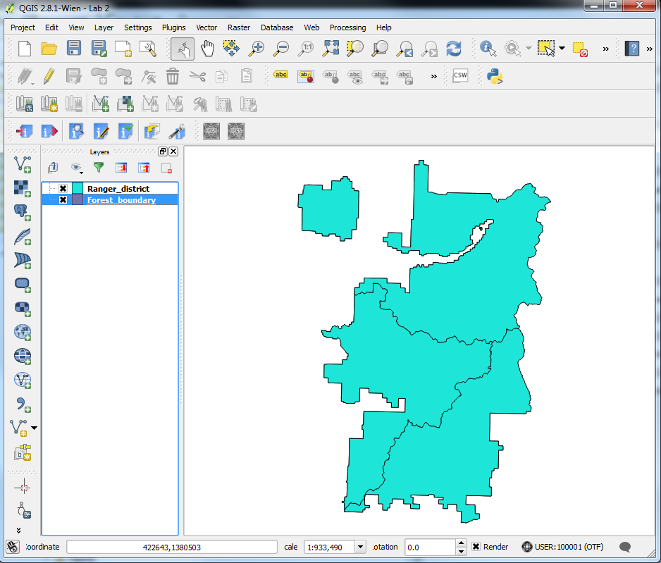
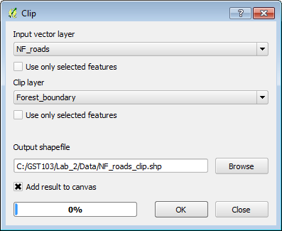
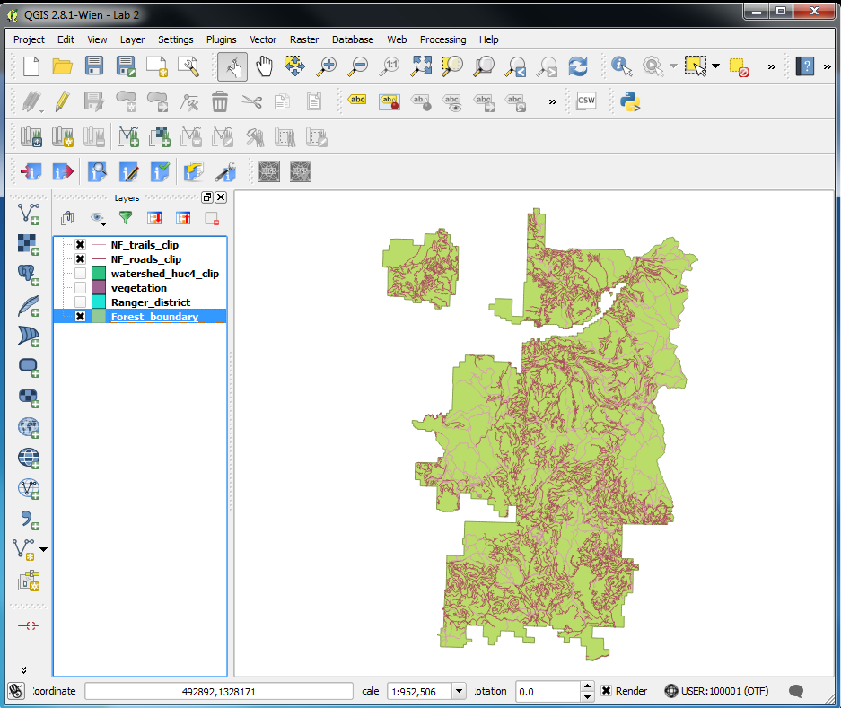
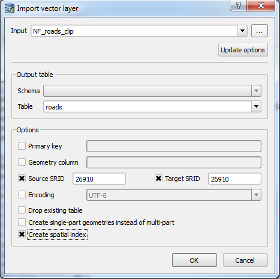

# GST 103: Data Acquisition and Management 
## Lab 2 - Setting Up a Project Database
### Objective – Learn How to Normalize Data and Import It into a SpatiaLite Database

Document Version: 4/26/2015

**FOSS4G Lab Author:**
Kurt Menke, GISP
Bird's Eye View GIS

**Original Lab Content Author:**
Richard Smith, Ph.D., GISP
Texas A&M University - Corpus Christi

---

The development of the original document was funded by the Department of Labor (DOL) Trade Adjustment Assistance Community College and Career Training (TAACCCT) Grant No.  TC-22525-11-60-A-48; The National Information Security, Geospatial Technologies Consortium (NISGTC) is an entity of Collin College of Texas, Bellevue College of Washington, Bunker Hill Community College of Massachusetts, Del Mar College of Texas, Moraine Valley Community College of Illinois, Rio Salado College of Arizona, and Salt Lake Community College of Utah.  This work is licensed under the Creative Commons Attribution 3.0 Unported License.  To view a copy of this license, visit http://creativecommons.org/licenses/by/3.0/ or send a letter to Creative Commons, 444 Castro Street, Suite 900, Mountain View, California, 94041, USA.

This document continues to be modified and improved by generous public contributions.

---

### 1. Introduction

There are two main data models for GIS data: vector and raster. Additionally, GIS data comes in many file formats. When gathering data for a project, it is common to acquire data from several sources. Therefore, it is also common for the data to be in several different file formats. In this lab you will create a project geodatabase for the Gifford-Pinchot National Forest in Washington State. First, you will normalize the data. This means that you will put all datasets in the same coordinate reference system (CRS) and clip them to the study area boundary. Lastly, you will put them all into the same file format: a SpatiaLite geodatabase. 

This lab includes the following tasks:

+ Task 1 Investigate and Normalize Project Data
+ Task 2 Create a New Database 
+ Task 2 Populate the New Database

### 2 Objective: Learn How to Normalize Data and Import It Into a SpatiaLite Database

The objective of this lab is to explore and understand geospatial data models and file formats.

###Task 1 Investigate and Normalize Project Data

In this task, you will familiarize yourself with the lab data and will begin to normalize the data.

2. Open QGIS Browser, navigate to and expand the Lab 2 Data folder. 

There are eight vector layers here. There are four shapefiles, two KML files, and two coverages (in the figure below). Each of these file formats will be treated in different ways. (*Note*: when there are multiple coverages in the same workspace they share the same info folder.)

4. All the data for this project will need to be in UTM, Zone 10, NAD83. Unfortunately, not all of the data are in that coordinate system, so we will convert all data to UTM Zone 10, NAD83.

5. Open QGIS Desktop.
6. Click the Add Vector Layer button and change the Source type to Directory. Then change the Type to Arc/Info Binary Coverage.
7. Browse to the Lab Data folder and select the admin_forest folder. Click Select folder (in the figure below). Click Open.

6. In the Select vector layers to add window choose 3 PAL (Polygon layer). Click OK. 

7. Save your project as Lab 2.qgs.

This layer is in a custom Albers Equal Area coordinate system. Since it is in a custom CRS, there is no EPSG code to use during import into a database. Therfore, we will first save this out to a shapefile in the desired CRS.

8. Right-click on the layer in the Layers panel and choose Save as… 
9. Save the resulting dataset as a shapefile named Forest_boundary.shp to the Lab Data folder.
10. Set the CRS to UTM Zone 10 NAD83 (EPSG 26910) (completed dialog shown in figure below).

9. Click OK to save the new shapefile and add it to the map.
10. Remove the PAL layer from the map as we no longer need it.
10. Export the ranger_dist coverage PAL polygon to a shapefile with the same coordinate system as the Forest_boundary layer. Once this has been completed, thet map should resemble the figure below.

The only other dataset in Albers Equal Area is the vegetation shapefile.

10. Add the gp_veg041008.shp shapefile to QGIS Desktop and save this as a new shapefile in UTM Zone 10 NAD83.
11. Add the NF_roads, NF_trails, and watershed_huc4 shapefiles to QGIS Desktop.

These last three layers are all shapefiles in the correct CRS. However, they extend beyond the forest boundary. We need to clip the layers to within the forest boundary.

12. Use the Vector | Geoprocessing Tools | Clip tool to clip the roads, trails, and watershed to the forest boundary (example clip parameters shown in the figure below). You can give them the same output name, but end it with clip. For example, NF_roads will become NF_roads_clip.

12. Remove the original unclipped roads, trails, and watershed layers once the three clip operations are complete. Your map should now resemble the figure below (note that not all layers are visible in the figure below).

You have taken the initial steps to normalize the data. There are two more layers that we will put in the SpatiaLite database; rivers and lakes. However, KML files are always in a geographic CRS of WGS 1984 (EPSG:4326). These KML files can be repojected when importing into the SpatiaLite database without having to be converted to another format.

14. Save your project.

###Task 2 Create a New Database

Now that you have taken the initial steps to prepare your data, you will create a new empty SpatiaLite database that you will import your datasets into.

1. Open your Lab2.qgs project in QGIS Desktop if it not already open.
2. Find the Browser panel. If your Browser panel is not visible, click View | Panels | Browser to turn it on.
3. Find the SpatiaLite database connection below your hard drives. Right-click on it and choose Create database (figure below).

4. Navigate to the Lab Data folder and name the new database GiffordPinchot.sqlite and click Save (figure below).

5. A dialog will appear stating that the database has been created. Click OK to dismiss.

The database will now appear under the SpatiaLite database connection.

6. Save your project.

###Task 3 Populate the New Database

Now you will populate the SpatiaLite database with the eight layers.

1. Open your Lab2.qgs project in QGIS Desktop if it is not already open.
2. Add the streams and lake KML layers to QGIS Desktop.
3. From the menu bar choose Database | DB Manager | DB Manager. Expand the SpatiaLite database connection . You will see the GiffordPinchot.sqlite database. If you expand the database, you will see many tables but no GIS layers yet (shown in figure below).

4. First, you will load the streams and lakes layers. Since these are KML, they are in a geographic CRS with an EPSG code of 4326. This is the case for all KML datasets.
5. Click the Import layer/file button  .

6. Set up the Input vector layer window as follows (shown in figure below):

	a. Set the Input as lakes

	b. Name the table lakes

	c. Check Source SRID and enter 4326
	
	d. Check Target SRID and enter 26910

	e. Check Create spatial index

	f. Click OK

7. Once the operation has completed successfully click the Refresh button  to see the lakes layer in the database.
8. Repeat the previous steps to import the streams KML.

Streams and Lakes were the final two layers that required a CRS reprojection. The remaining six UTM layers can now be imported. The only change is that both the input and target SRID’s will be 26910 (UTM Zone 10 NAD83).

10. Click the Import layer/file button  .
11. Set up the Input vector layer window as follows (shown in figure below):

	a. Set the Input as NF\_roads\_clip

	b. Name the table roads

	c. Check Source SRID and enter 26910

	d. Check Target SRID and enter 26910

	e. Check Create spatial index

	f. Click OK

13. Repeat the above steps for trails, watersheds, ranger districts, vegetation, and forest boundary layers.
14. Now that all eight layers have been imported you can remove the original layers from the map.
15. The layers in the database can be added via the DB Manager or the Add SpatiaLite Layer button. 
16. If using the DB Manager, right-click on a layer and choose Add to canvas. 
17. If using the Add SpatiaLite Layer button , select the database and click the Connect button. Once the layers appear, you can select them and click Add, which will add them to QGIS (figure below).

### 3. Conclusion

In this lab, you took data in several different file formats and CRSs and normalized them. They are all now in the same CRS, clipped to the forest boundary, and in a geodatabase. This methodology has the benefit of creating a working copy of the data. The raw data still exist. Therefore, if you accidentally delete or corrupt a dataset, you still have the original files. Additionally, the data now all reside in a tidy database. Since they are all in the same CRS, you can run any geoprocessing or analysis tools against them knowing they are all in UTM Zone 10 NAD83.

### 4 Discussion Questions

1. What are the steps involved in setting up a SpatiaLite database?
2. What are the advantages of normalizing project data?
