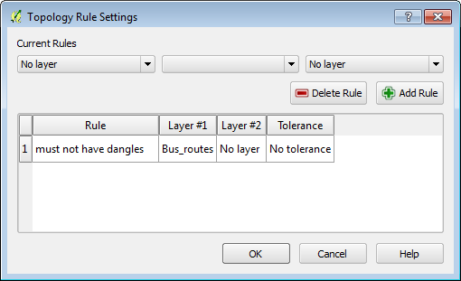
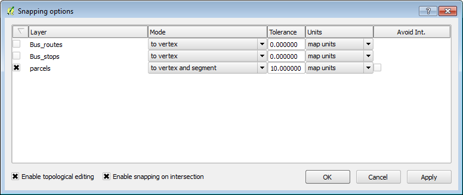
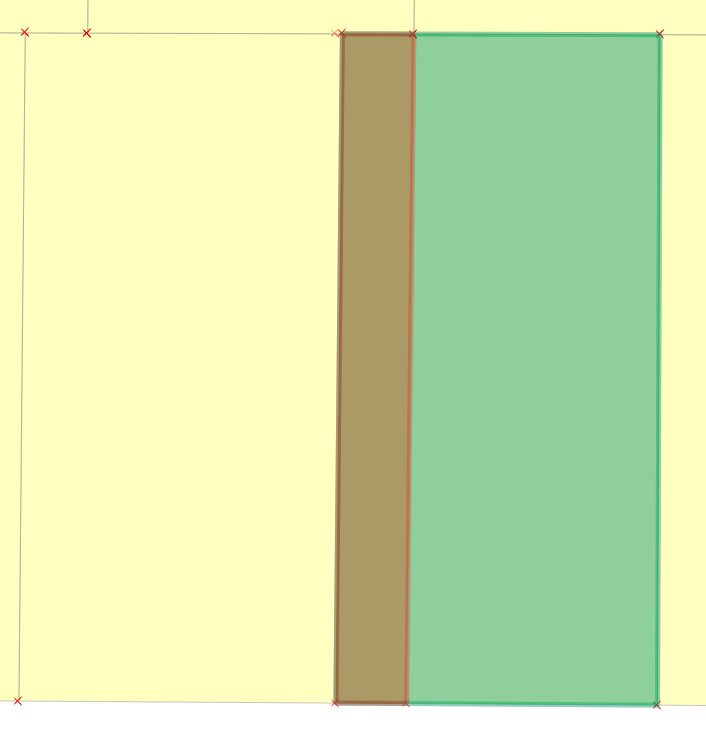
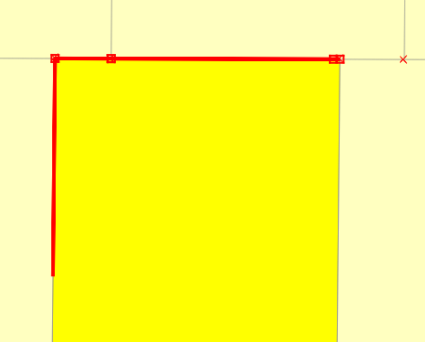

# GST 103: Data Acquisition and Management 
## Lab 3 - Vector Data Quality
### Objective – Learn to  Verify the Quality of Vector Data with Topology Rules

Document Version: 4/27/2015

**FOSS4G Lab Author:**
Kurt Menke, GISP  
Bird's Eye View GIS

**Original Lab Content Author:**
Richard Smith, Ph.D.  
Texas A&M University - Corpus Christi

---

The development of the original document is funded by the Department of Labor (DOL) Trade Adjustment Assistance Community College and Career Training (TAACCCT) Grant No.  TC-22525-11-60-A-48; The National Information Security, Geospatial Technologies Consortium (NISGTC) is an entity of Collin College of Texas, Bellevue College of Washington, Bunker Hill Community College of Massachusetts, Del Mar College of Texas, Moraine Valley Community College of Illinois, Rio Salado College of Arizona, and Salt Lake Community College of Utah.  This work is licensed under the Creative Commons Attribution 3.0 Unported License.  To view a copy of this license, visit http://creativecommons.org/licenses/by/3.0/ or send a letter to Creative Commons, 444 Castro Street, Suite 900, Mountain View, California, 94041, USA.  

This document was original modified from its original form by Kurt Menke and continues to be modified and improved by generous public contributions.

---

### 1. Introduction

GIS data are referred to as models because they represent actual real world objects. It is important that they model the real world as accurately as possible. Often GIS datasets will have thousands of features. It can be challenging to verify the quality of such large datasets by visual means alone. Using topology rules we can test our data and ensure that it is well constructed. 

This lab includes the following tasks:

Task 1 Topology Rules - Part 1

Task 2 Topology Rules - Part 2

Task 3 Fixing Topology Errors

**2	Objective: Learn To Verify the Quality of Vector Data with Topology Rules**

In this lab you will be explore the spatial relationship between point’s lines and polygons. You will be build topology rules and validate them to identify data errors.

###Task 1		Topology Rules - Part 1

In this task, you will use the Topology Rules plugin to investigate the quality of two datasets: bus routes and bus stops. 

1. The data for this lab is located in: GST103\Lab_3\Data.
2. Open QGIS Desktop and add the parcels.shp, Bus_stops.shp and Bus_routes.shp layers to QGIS (figure below).

3. Save your project as Lab_3.qgs
4. From the menu bar, choose Plugins -> Manage and Install Plugins. Select the Installed tab and enable the Topology Checker plugin (figure below).

5. Click on the Topology Checker   button to open the Topology Checker panel (figure below).

6. First, you will investigate the integrity of the Bus Stops layer. Click the Configure button at the bottom of the Topology Checker panel. This opens the Topology Rules Settings window. Here you can set up a variety of topology rules.
7. Under Current rules choose Bus_stops as the layer. Click the second drop down to see what topology rules are available for point layers. Choose ‘must not have duplicates’. This rule will check to make sure there are no stacked points, in other words, a bus stop situated directly over another. This type of error is difficult to identify without a topology rule. Click the Add Rule button to have the rule established (figure below).

8. Click the Validate All button. 

**NOTE.** You can also choose to zoom into a particular area and just validate the topology rule within the current extent by clicking instead the Validate Extent button.

9. The topology checker finds three duplicate geometries which are listed in the Topology Checker panel with their Feature ID’s and the rule they are violating. (figure below).

10. Additionally the duplicated points are highlighted in red on the map. Again, these errors would be difficult to find any other way. However, once identified, they are easy to fix. Simply toggle on editing, select the duplicates and delete them. 
11. Now you will examine the Bus_routes. Click the Configure button again. Select and delete the Topology rule for the Bus Stops. Now create a new rule for the Bus_routes, using must not have dangles. This means the endpoint of a dangling line will be identified. You might expect that since these data are only a portion of an urban area, and there are bus routes heading off the map that those dangling endpoints will be identified. However, there should not be any in the middle of the network. Click the Add Rule button and click OK (figure below). 

12. Validate the topology. The Topology Checker finds 25 errors of this type. Many are the expected ones, for example lines heading off the map edge. However, there are several in the middle of the network. See the black arrows on the figure below. Zoom in to some of these errors and investigate.

13. Save your map.

###Task 2		Topology Rules - Part 2

Now you will implement topology rules to check the integrity of the parcels layer.
	
1. Open your Lab3.qgs project in QGIS Desktop if it not already.
2. Click on the Topology Checker to open the Topology Checker panel if not open already.
3. Click the Configure button.
4. Select any existing rules and click the Delete Rule button to remove them.
5. Configure three rules for the parcels layer: must not have gaps, must not overlap and must not have duplicates (figure below).

6. Click Validate All.
7. The Topology Checker will report violations for each rule, seventeen errors in all.
8. Save your project.

###Task 3		Fixing Topology Errors

Now you will edit the parcel layer to eliminate these errors. 

1. Open your Lab3.qgs project in QGIS Desktop if it not already.
2. Re-validate the topology rules if they are not appearing.
3. First, you will work on the duplicate geometries. Right click on the parcels layer and choose Toggle Editing.
4. Double click on the first duplicate geometry error in the Topology Checker to zoom into that location.
5. Use the Select Feature by area or single click tool (You may need to use the select by polygon tool and draw a polygon around the highlighted area   to select the duplicate parcels.
6. Open the parcel layer attribute table. 
7. Change the display filter in the lower right corner to Show Selected Features. 
8. Notice that all the attributes are identical.
9. Select the feature with the higher row number by clicking on it. This leaves just one selected record. Close the attribute table and click the Delete selected   button to remove the duplicate parcel.
10.	Repeat steps 4-9 for the remaining duplicate geometry. The attribute table should now show a total of 6968 records.
11. To fix the remainder you will need to go set your snapping tolerances. From the menu bar choose Settings -> Snapping Options. You may need to change the snapping mode from current layer to advanced then uncheck Bus_routes and Bus_stops so that the snapping will be set only for parcels. Set the Mode for parcels to to vertex and segment and the Tolerance to 10 map units (figure below) Also check Enable topological editing and Enable snapping on intersection. Topological editing maintains common boundaries in polygon mosaics. With this option checked QGIS detects a shared boundary in a polygon mosaic and you only have to move the vertex once, and QGIS will take care of updating the other boundary.

12. From the menu bar choose Settings -> Options and click on the Digitizing tab. Set the Search radius for vertex edits to 10 (figure below). Setting this to something other than zero ensures that QGIS finds the correct vertex when editing. 

13. Open the Layer properties for the parcels layer and from the Style tab set the transparency to 50%.  
14.	Uncheck Show errors on the Topology Checker panel and double click on the error for Feature ID 624. The map will zoom to the location of the error. With errors turned off and the transparency set, you can see the overlap issue (figure below).

15. There are two parcels involved in the overlap. Here the western (left) overlapping parcel boundary needs to be moved west (left) so that it does not overlap with the eastern parcel (parcel on the right). 
16. Use the Select Feature by Rectangle tool   to select the western (left) overlapping parcel. The vertices of the selected feature will appear as red X’s.
17.	Click on the Node tool  . This tool allows you to move individual feature vertices. Click on a vertex of the selected feature and the vertices will show as red boxes (figure below).

18.	Click on the upper right vertex and the selected vertex and adjoining arcs will turn blue (figure below). Drag that selected vertex until it snaps to the boundary of the parcel it is overlapping.

 

19.	Repeat for the lower right vertex and the overlap should now be resolved (figure below).

20.	Click Validate Extent  in the Topology Checker panel to check and ensure that the overlap was taken care of. There is one other issue with this parcel. There is a tiny overlap in the northwest corner (figure below). This very small overlap cannot be seen at this scale. To resolve this, simply select the affected vertices with the Node tool, and snap them back into place. The overlap is so small you won’t see them move, however, the overlap will be resolved with due to the Topological editing setting.

21. The remaining overlaps can be fixed in the same fashion.
22.	From the Topology Checker panel click on the first Gap error in the list (for Feature ID 0). Again you will be zoomed to the location of the error (figure below).

23.	There is a small sliver between the parcels. Select the parcel to the north and click on the Node tool. Uncheck Show errors.
24.	Select the vertex in the southwestern corner of the selected parcel. Drag it until it snaps with the parcel vertex to the south, closing the gap.

25.	Click Validate extent to ensure that the issue has been resolved. 
26.	You can repair the other gap errors the same way.

### 5 Conclusion

In this lab, you learned how to test the integrity of your vector data with topology rules. These rules can involve features in two different layers or can be set to test the features in a single layer. There are different rules for points, lines and polygon features. You also learned how to use Topological editing to resolve the issues found. 

### 6 Discussion Questions

1. What are the steps involved creating and testing a topology rule?
2. Explain the use of topology in industry.
3. How would topology be useful for property data?

### 7 Challenge Assignment (Optional)

See if you can think of other topology rules that could be implemented against these data sets. Use topological editing to fix all the errors found.