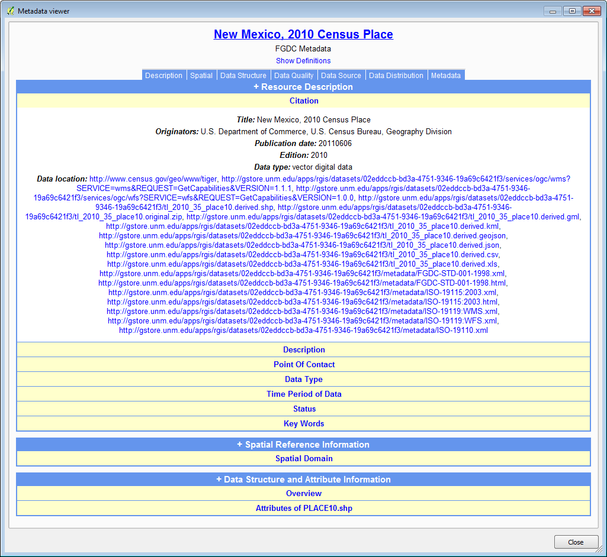

# GST 103: Data Acquisition and Management 
## Lab 4 - Spatial Data Quality
### Objective – Learn to Assess Data Quality, Work with Metadata and Aggregate Data

Document Version: 5/4/2015

**FOSS4G Lab Author:**
Kurt Menke, GISP
Bird's Eye View GIS

**Original Lab Content Author:**
Richard Smith, Ph.D., GISP
Texas A&M University - Corpus Christi

---

The development of the original document was funded by the Department of Labor (DOL) Trade Adjustment Assistance Community College and Career Training (TAACCCT) Grant No.  TC-22525-11-60-A-48; The National Information Security, Geospatial Technologies Consortium (NISGTC) is an entity of Collin College of Texas, Bellevue College of Washington, Bunker Hill Community College of Massachusetts, Del Mar College of Texas, Moraine Valley Community College of Illinois, Rio Salado College of Arizona, and Salt Lake Community College of Utah.  This work is licensed under the Creative Commons Attribution 3.0 Unported License.  To view a copy of this license, visit http://creativecommons.org/licenses/by/3.0/ or send a letter to Creative Commons, 444 Castro Street, Suite 900, Mountain View, California, 94041, USA.

This document continues to be modified and improved by generous public contributions.

---

### 1. Introduction

Spatial data is becoming more common and readily available via the internet. However, the accuracy of the data is always a concern. As we are experiencing a growth in data availability, we should choose our sources wisely. When it comes to data accuracy, not only do we look at the spatial component, but the attribute component as well. Metadata is becoming a large component to data and it is a key factor in determining the completeness of data.

This lab includes the following tasks:

+ Task 1 Exploring Data Accuracy
+ Task 2 Metadata
+ Task 3 Data Aggregation

### 2. Objective: Learn to Assess Data Quality, Work with Metadata and Aggregate Data

This lab focuses on data and the accuracy thereof. You will be looking at the metadata and the standards of the metadata that some datasets require and have. You will also look at assessing the accuracy of the data and if it is usable or not.

###Task 1 Exploring Data Accuracy

Data accuracy is an important concept and this goes for the spatial data as well as the attribute data. The spatial and attribute data can be edited and changed, but what if it is a noted problem in the data? Can we overlook certain points in the data that we know have been captured erroneously? We must be aware of the errors that are inherent in the data and the fixes that are provided. In this first task, you will create a point layer of shipwrecks from a text file containing the X and Y coordinates. You will then assess its accuracy.

2. Open QGIS Desktop and add the great_lakes.shp shapefile from the Lab Data directory.
3. Click the Add Delimited Text Layer   button. Fill out the form as in the figure below.

	a. File Name: Browse to the lab data folder and select shipwrecks.csv

	b. Layer name: Shipwrecks

	c. File format: CSV (comma separated values)

	d. Check First record has field names

	e. Geometry definition: Point coordinates

	f. X field: X_COORD,N,15,6

	g. Y field: Y_COORD,N,16,6

	h. Click OK

4. The Coordinate Reference System Selector will appear. Choose WGS 84 (EPSG:4326) and click OK.
4. Right-click on the Shipwrecks layer in the Layers panel and choose Zoom to layer.
5. Notice that one point is well away from the others.
6. Open the attribute table for shipwrecks. Notice the coordinate values for the AC Adams. The X and Y values are in the wrong columns. This was a data entry error. Close the attribute table and remove the shipwrecks layer. 

*Note*: Another common issue that occurs with coordinate data are rounding errors or truncated coordinates. For example, people may round UTM coordinates to the nearest thousand when working off of USGS topographic maps. This may be due to the fact that these maps list the UTM coordinate values every 1,000 meters.

*Note*: When creating a point layer from a delimited text file, the coordinates are being mapped just within the current QGIS Desktop program instance. The data are still not in a GIS format, such as a shapefile. To create a permanent GIS layer, you would right-click on the layer and save it as a shapefile or other format.

7. Using a text editor such as Notepad or a spreadsheet program such as Open Office Calc or Microsoft Excel, open the shipwrecks.csv file and correct the incorrect coordinates, then save your edits.
8. Recreate the layer from the corrected delimited text file.
8. The data points should all fall near the western end of Lake Superior.
9. One must always be careful about data and not take their accuracy for granted. It is your responsibility to discover and fix errors. You cannot rely on the software to understand such mistakes.

### Task 2 Metadata

In this task, you will be looking at the metadata section of spatial data. When data is purchased, or published online by an agency or organization, we expect to have a complete dataset. This includes the spatial data, the attribute data and the metadata. Metadata is data about data, and is the one sure way we can understand the source, how it was created, what scale it was created at, what the spatial reference is, what kinds of accuracy can we expect, etc. All datasets have some error associated with them. After all, they are simplified models of the real world. 

1. Open QGIS Desktop and start a new project.
2. Add the tl_2010_35_place10.shp shapefile to QGIS. This is metropolitan areas of New Mexico.
3. You can open the Layer properties and click on the Metadata tab to see some basic information regarding the layer (at the bottom under Properties).

However, actual metadata is a U.S. Federal standard maintained by the Federal Geographic Data Committee. One of the files that composes a shapefile is a metadata file. It can take several forms: text, HTML or XML. These can be opened in a text editor or in a web browser. However, there is also a QGIS plugin to read and edit metadata files.

4. From the menu bar choose Plugins | Manage and Install plugins.
5. Click on the Settings tab and click the Show also experimental plugins option.
6. Click on the All tab and search for Meta.
7. Locate the Metatools plugin and install it (shown in figure below). Close the Plugins window.

5. This is an experimental plugin at this point. However, it is well conceived and very useful. It loads a toolbar with several tools (shown in figure below). 

*Note*: If you are working on a Windows computer you will need to open the Python Console for the tool to run. To do this click Plugins | Python Console. Other operating systems such as MAC OSX and Linux may not require this step.

7. Select the tl_2010_35_place10 in the Layers panel and click the View metadata   button.
8. The Metadata Viewer will open (shown in figure below).

Metatools parses the metadata file and presents it in an easily readable format.

The FGDC Metadata Standard contains six major sections as seen below.

+ **Identification Information** – Includes the data title and abstract

+ **Data Quality Information** – Information about the accuracy and precision of the data, including the processing steps taken to produce it.

+ **Spatial Organization Information** – Information about the file format.

+ **Spatial Reference Information** – The coordinate reference system used including: projection/coordinate system, datum, and other parameters.

+ **Entity and Attribute Information** – Explanations on the field types and data contained within each attribute column.

+ **Distribution Information** – Contact information of the data provider.

10. Click on Description to expand that section. This provides an abstract and purpose for the data.
11. The viewer is not completely parsing this metadata file. If you click on the Data Quality section it is blank.
12. To see the Data Quality section, open the Lab 4 Data\tl_2010_35_place10.shp.xml file in a web browser. You should be able to double click on it and have your operating system locate the associated program. This is the raw XML metadata.
13. This is certainly harder to look at than the parsed display in Metatools. Fortunately, all metadata files have the same sections in the same order. This is due to having a standard.
14. Scroll down past the abstract and you will find a tag called dataqual. This section contains the Logical Consistency Report, which details the tests used to determine the data quality (shown in figure below).

15. Slightly farther down you will find the <attr> section. This section details all of the attribute columns.
16. Close the web browser with the metadata XML displayed.
17. Close the Metadata Viewer in QGIS Desktop.
18. Click on the Edit Metadata   button to open the Metadata editor. Expand metadata and you will see abbreviated listings of the six FGDC metadata sections.(see figure below).

19. Expand dataqual. If you click on an entry such as logic you will see that entry. You can use this editor to edit the text and save the metadata. 
20. Close the Metadata Editor.

The Import and Export buttons  allow you to save out a copy of the metadata. Many organizations will set up a metadata template with items that will be the same from metadata file to metadata file, such as contact information. If you have such a template, you can use the Import tool to import the metadata template. The Metadata Editor can then be used to complete the record.

### Task 3 Data Aggregation

Data aggregation is the process where data is joined, merged, or generalized to suit a need. This may be done in such a way to protect the information at a lower level.

1. Open QGIS Desktop and start a new project.
2. Add the countries.shp shapefile to QGIS.
3. From the menu bar choose Vector | Geoprocessing Tools | Dissolve.
4. Set up the dissolve tool to dissolve based on the SubRegion attribute field. Name the output Sub_Regions.shp (shown in figure below).

The result is an example of data aggregation. All the data in the map will be mapped using those regions (shown in the figure below). In this scenario, all data by country will be aggregated to the sub region level. 

### 3. Conclusion
Spatial and attribute data accuracy is important. Having a complete data set and keeping track of all the edits and errors is also important. Metadata provides background on the data provided to us. It supplies us with vital information regarding the use and resolution of the data. If you read the metadata, you may be able to determine that the data is not a good fit for your project before trying to edit and manipulate it. Data aggregation is a way to abstract the data and to remove data levels from the data. In task 3, you changed the lowest level in the data from countries to sub regions. This is important but we need to be aware of the consequences of our actions when mapping data and how the accuracy is changed when we manipulate it.

### 4. Discussion Questions

1. Does metadata need to be written for all datasets? Explain.
2. Why do we need a metadata standard?
3. How can data aggregation problematic in a real world mapping scenario?

### 5. Challenge Assignment (optional)
Add the NM_Game_Management_Units shapefile to QGIS. View the metadata. Take note of the Horizontal Coordinate System. 

What is provided as the Positional Accuracy?

Aggregate the Game Management Units into Cougar Zones.

Add a Delimited Text layer of cougar_sample_points. Note: once mapped the CRS for the cougar sample points will need to be defined. QGIS will default to a geographic CRS and you will have to redefine the CRS in Layer Properties. They are in the same CRS as the Game Management Units.

Do all the cougar sample points fall correctly in New Mexico?
If not can you identify the issue with any points that are not falling in the correct location?
