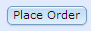

# GST 103: Data Acquisition and Management 
## Lab 5 - Raster Data Structure
### Objective – Work with the Raster Data Model

Document Version: 4/29/2015

**FOSS4G Lab Author:**
Kurt Menke, GISP  
Bird's Eye View GIS

**Original Lab Content Author:**
Richard Smith, Ph.D.  
Texas A&M University - Corpus Christi

---

The development of the original is funded by the Department of Labor (DOL) Trade Adjustment Assistance Community College and Career Training (TAACCCT) Grant No.  TC-22525-11-60-A-48; The National Information Security, Geospatial Technologies Consortium (NISGTC) is an entity of Collin College of Texas, Bellevue College of Washington, Bunker Hill Community College of Massachusetts, Del Mar College of Texas, Moraine Valley Community College of Illinois, Rio Salado College of Arizona, and Salt Lake Community College of Utah.  This work is licensed under the Creative Commons Attribution 3.0 Unported License.  To view a copy of this license, visit http://creativecommons.org/licenses/by/3.0/ or send a letter to Creative Commons, 444 Castro Street, Suite 900, Mountain View, California, 94041, USA.  

This document was originally modified from its original form by Kurt Menke and continues to be modified and improved by generous public contributions.

---

### 1. Introduction

Raster data is a data model in which the data is presented in a grid. Each grid cell contains one data value or attribute. For example, digital elevation model (DEM) has cell values that represent the elevation above sea level. One important characteristic of raster data is the resolution. Raster resolution is a measure of the cell dimensions, which means the area that each cell covers in the real world. For example, a satellite image may have a resolution of 30 meters, each cell covers 30 square meters in the real world. You can use raster data simply as cartographic backdrops, or as datasets for digitizing or doing analysis.

This lab includes the following tasks:

+ Task 1 Merging and Clipping Raster Data
+ Task 2 Raster Pyramids

### 2. Objective: Work with the Raster Data Model

This lab focuses on working with raster data within QGIS.

### Task 1 Merging and Clipping Raster Data

Raster data are often provided in tiles, such as USGS Quadrangles. In such cases, it is necessary to merge the datasets together to form a seamless raster covering the study area. 

2.	Open QGIS Desktop and add the four DEM raster datasets (change option to all files if your DEM doesn't show)(35106-A4.dem, 35106-A5.dem, 35106-B4.dem and 35106-B5.dem) (figure below).

3. Each of these has cell values representing the elevation above sea level. Each is styled with the values stretched across a black to white color ramp. Since each dataset has different minimum and maximum cell values the boundaries between datasets is obvious.

4. Save your project as Lab_5.qgs

5. Double click on the 35106-B5.dem layer and open the Layer Properties.

6. Click on the Metadata tab.

7. In the Properties window you will find information about the file format (Driver), cell statistics (Band 1), Dimensions, Origin, Pixel size (10 meters), the No Data value and the Data Type. 
8. Raster datasets are always rectangular. If the data content does not fill the rectangular area, the extra cells will be assigned a value that signifies that there is no data there. Here the No Data value is -32767.
9. Close the Layer Properties.
10. Turn on the Processing toolbox by clicking on the Processing menu -> Toolbox.
11. At the bottom change simplified interface to Advanced interface.
12. From the Toolbox choose SAGA -> Grid-Tools -> Merge raster layers (Figure 2).

 a.	Click the ellipsis button  in the upper right corner and select all four dem rasters (figure below).

 b.	Preferred data storage type = [6] 4 byte signed integer.

 c.	Interpolation = [1] Bilinear Interpolation

 d.	Overlapping cells = [1] first value in order of grid list

 e.	Merged grid = Lab_5\Data\Merge.tif

 f.	Click Run (figure 3).

12.	Turn off the input DEM’s in the Table of Contents (figure below). You now have a seamless raster. 

13. Now you will clip the merged dem to the project study area.
14.	Add the StudyArea.shp shapefile to QGIS Desktop.
15.	From the menu bar choose Raster -> Extraction -> Clipper.
	
 a.	Input file (raster) = Merged Grid

 b.	Output file = Lab_5\\Data\\StudyArea.tif

 c.	Clipping Mode = Mask Layer

 d.	Mask layer = StudyArea

 e.	Click OK.

 f.	Click Close when done.

16.	This is a common workflow to get raster data set up for an analysis.
17.	Save your project.

### Task 2 Raster Pyramids

Pyramids are lower resolution versions of a raster dataset that are more suitable for display on a monitor. Without pyramids, the computer will attempt to render each and every pixel in a raster dataset, whether the computer monitor can display all the detail or not. Having pyramids greatly decreases the time it takes to render a raster on screen.
	
1. Open Lab_5.qgs in QGIS Desktop.
2. Open the Layer Properties for the Merged Grid.
3. Click on the Pyramids tab. Currently this raster has no pyramids. The available resolutions are listed on the right side (figure below).

4. Pyramids can be embedded within the raster file, or built externally. It is safer to build them externally as this does not alter the original dataset. The external pyramid file can always be deleted if it does not have the desired results.
5. Select all 6 resolutions: 1164 x 1408 to 36 – 44.

 a.	Overview format = External

 b.	Resampling method = Cubic (Generally nearest neighbor technique is most suitable for discrete rasters since it will not change the values of the cells. The average, gauss, and cubic techniques are more suitable for continuous rasters such as this DEM. They will cause some smoothing of the data and may result in some values that are beyond the original range.)

 c.	Click Build Pyramids

6. This dataset is small enough that you may not notice an improvement in drawing speed. However, it can be quite dramatic for large rasters over 100 Mb in size.

7. Switch to the Metadata tab. Under Dimensions you will see the pyramids resolutions that were built. 

8. Open a file browser (for example: Windows explorer or Finder) and navigate to the Lab_5 folder. You will see a Merge.tif.ovr file. This is the file containing the pyramids.

### 5. Conclusion
In this lab you focused on preparing raster data so that it seamlessly covers a study area. You also learned how to build pyramid files for a raster dataset. 

### 6. Discussion Questions

1. What is a raster dataset?
2. Compare and contrast raster and vector data models.
3. Why might you use raster data? Give two examples.

### 7. Challenge Assignment (Optional)

Using the National Map (http://viewer.nationalmap.gov/viewer/) download DEM’s for an area interesting to you. 

1. Select an area of interest using the Download by Bounding Box tool  . With this tool, drag a box around an area roughly the size of a large county or several small counties.  
2. Click the Download Data   button. 
3. From the USGS Available Data for download select Elevation.

 

4. All the available DEM’s will be displayed. 
5. Select the 1/9 arc-second datasets covering your area.

 

6. Click Next

7. Click the   button. 

8. Enter your email address.

9. Click the   button.

10.	You will be notified via email when the data are available. You will be provided with download links for each dataset. Download and unzip the data.
11.	Merge the rasters together and build pyramids for the merged dem.