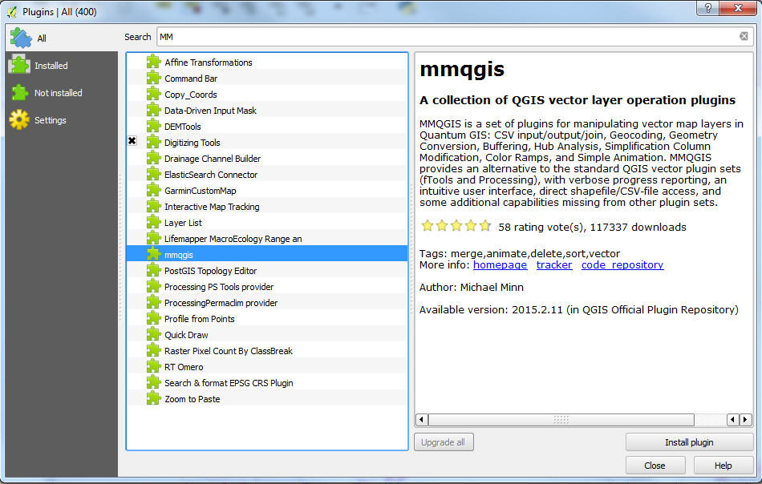
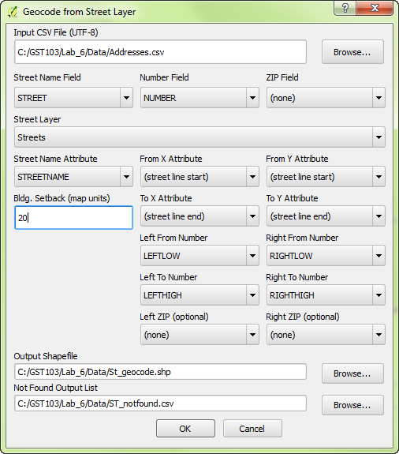
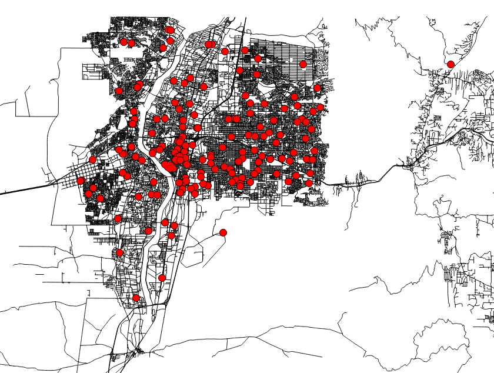
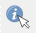
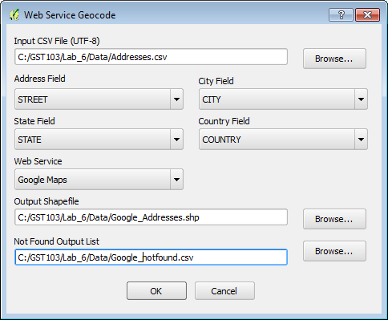
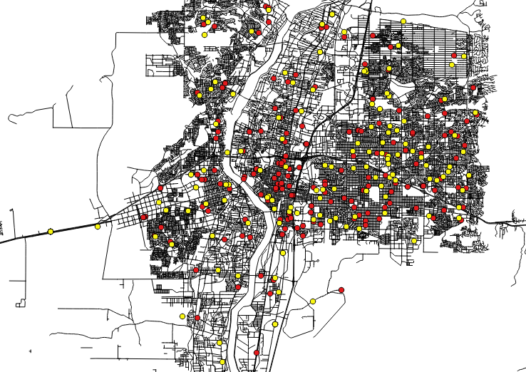

# GST 103: Data Acquisition and Management 
## Lab 6 - Data Sources
### Objective – Learn to Map Address Data via Geocoding

Document Version: 4/26/2015

**FOSS4G Lab Author:**
Kurt Menke, GISP
Bird's Eye View GIS

**Original Lab Content Author:**
Richard Smith, Ph.D., GISP
Texas A&M University - Corpus Christi

---

The development of the original document was funded by the Department of Labor (DOL) Trade Adjustment Assistance Community College and Career Training (TAACCCT) Grant No.  TC-22525-11-60-A-48; The National Information Security, Geospatial Technologies Consortium (NISGTC) is an entity of Collin College of Texas, Bellevue College of Washington, Bunker Hill Community College of Massachusetts, Del Mar College of Texas, Moraine Valley Community College of Illinois, Rio Salado College of Arizona, and Salt Lake Community College of Utah.  This work is licensed under the Creative Commons Attribution 3.0 Unported License.  To view a copy of this license, visit http://creativecommons.org/licenses/by/3.0/ or send a letter to Creative Commons, 444 Castro Street, Suite 900, Mountain View, California, 94041, USA.

This document continues to be modified and improved by generous public contributions.

---

### 1. Introduction

Data collection is an important task in the creation of a GIS. Data can come from several sources such as GPS receivers, text files, or from the internet as shapefiles. You may even receive a coverage. The GIS can manage all of this data. We may receive data with an address that we want to display on a map. We can geolocate items using an address via a process known as geocoding. This tool helps us take point features from a text file and tie it to an address by the use of an address.

This lab includes the following tasks:

+ Task 1 Geocoding
+ Task 2 Build a Map

### 2 Objective: Learn to Map Address Data via Geocoding
The objective of this lab is to learn how to geocode address based data provided in a text file and create a map from various data sources.

### Task 1 Geocoding

In a geocoding operation, address data contained in a table or text file are mapped against a street network dataset. The street network dataset needs to have attribute fields for address ranges on the left and right side of each road segment. Mapping addresses has many applications including mapping: the customer base for a store, members of an organization, public health records, and crime locations. Once mapped, the points can be used to generate density surfaces and can be tied to parcels of land. This can be important in cadastral information systems.

2. Open QGIS Desktop and add the Streets.shp shapefile.
3. Open the Attribute table for Streets and examine the available fields of data. Notice that in addition to the STREETNAME and STREETDESI columns that the data include fields called LEFTLOW, LEFTHIGH, RIGHTLOW, and RIGHTHIGH. These fields hold the address range for each road segment. These are necessary in a geocoding operation.
4. Close the attribute table.
4. Click the Add Vector Layer button and add the Addresses.csv table to QGIS Desktop.
5. Open the attribute table for the Addresses layer.
5. This file has an ADDRESS column that combines the street number, street, street type (ex: BLVD, AVE, ST), and city quadrant. There are additional fields with that address parsed out into STREET, NUMBER and QUAD. The tool you will be using requires separate fields in the address data for street and street number.
6. Now that you are familiar with the data, close the Addresses attribute table.
7. To geocode you will use a Plugin called MMQGIS. From the menu bar choose Plugins | Manage and Install Plugins.
8. Choose the All tab and type ‘MMQGIS’ into the Search bar.
9. Find the plugin named mmqgis and click Install plugin (shown in figure below).
10. When complete click Close.

MMQGIS appears as a separate menu in QGIS Desktop.

10. From the menu bar choose MMQGIS | Geocode | Geocode from Street Layer.
11. Click the Browse button, navigate to the Lab 6 Data folder and choose the Addresses.csv table. Fill in the remaining choices as shown in the figure below.

	a. First set the fields that hold street name and number in the Address.csv file.

	b. Then assign the field in the Streets shapefile that contains the street name.

	c. The Bldg. Setback allows you to specify how far from the street arc to place the points. Street GIS data are known as street centerlines. The line falls where the median is on a large boulevard. Using this setting allows you to place the points more closely to the buildings actual location. Set this to 20. The map units of this dataset are in feet. This distance roughly corresponds to the width of two road lanes.

	d. The result will be a point shapefile. Name the Output Shapefile Geocoded_Addresses.shp and save it to the Lab 6 Data folder.

	e. Geocoding operations rarely have 100% success. Street names in the street shapefile must match the street names in the CSV file exactly. The tool will save out a list of the unmatched records. Set Not Found Output List to Geocoded_Addresses_Not_Found.csv to the Lab 6 Data folder.

	f. Click OK to run. This process may take several minutes. The status of the geocoding will display in the bottom-left corner of QGIS Desktop.

12. When complete the new layer is added to QGIS Desktop. You should get 199 out of the 203 addresses to be geocoded (shown in figure below).

13. Open the attribute table for Geocoded_Addresses. All of the attributes from the CSV file are brought in as attributes to the output shapefile.
14. Right click on the Geocoded_Addresses layer and choose Zoom to Layer. All of the points look to be well mapped.
15. Zoom into a concentration of points and then zoom in farther to some within the city. Use the Identify tool to inspect the mapped points and the roads to ensure that the operation was successful. Never take a GIS operation for granted. Check your results with a critical eye.
16. You can also add the Geocoded_Addresses_Not_Found.csv file to QGIS Desktop and study it to try and determine why the four records did not find a match.
17. These are good geocoding results. Now you will try the other method available: geocode using the Google Geocoder.
18. From the menu bar choose MMQGIS | Geocode | Geocode CSV with Google/OpenStreetMap.
19. This tools uses the same geocoding engine that is used when you type an address into Google maps. *Note*: This tool requires an internet connection.
20. Fill out the Web Service Geocode parameters so they match the figure below:

	a. Click the Browse button, navigate to the Lab 6 Data folder and choose the Addresses.csv as the Input CSV File (UTF-8).

	b. Address Field = STREET

	c. City Field = CITY

	d. State Field = STATE

	e. Country Field = COUNTRY

	f. Web Service = Google Maps

	g. Output Shapefile = Google_Addresses.shp

	h. Not Found Output List = Google_Not_Found.csv

	i. Click OK to run. Again, this may take a while and progress is displayed in the lower-left corner of QGIS Desktop.

19. This may take several minutes to run and in part depends on the speed of your internet connection.
20. This technique matches all 203 records. The figure below shows the Google Addresses in yellow and the street layer geocoded addresses in red. Note that they differ!

21. Right-click on the Google_Addresses.shp and choose Zoom to Layer. These, too, seem to be well mapped. Although there is a discernible difference between the address point locations identified by the two tools. The Google_notfound.csv is an empty text file since Google found a match for each record.
23. Again, zoom in to some sample address points and spot check the results to determine if the points are on the street they should be. Can you determine which output is more accurate?
24. Congratulations! You have created points from a table of addresses!
25. Save your map as Lab_6.qgs.

### Task 2 Build a Map

At the end of your data collection, a product is usually required. In this case, a map is necessary to complete the lab. Data from several data sources have been downloaded and included in your lab data folder.	

1. Open Lab_6.qgs in QGIS Desktop if necessary.
2. Add the jurisdiction, biketrails, and council shapefiles. Jurisdiction is the municipal boundaries for Albuquerque, New Mexico. Council is the City Council Districts. Bike trails are municipal bike trails.
3. Using QGIS Desktop, style the layers and use the Print Composer to compose a letter sized color map highlighting the different Facilities (Google_Addresses) by City Council District.
4. You will have to style the Google Addresses and City Council Districts using Categories.
5. Symbolize Bike Trails, Streets, and Jurisdiction as you see fit.
6. If you need a refresher on how to compose a map you can refer to GST 101 Lab 4.
7. Submit a jpg of your final map.

### 3. Conclusion

In this lab you learned how to geocode address data using the MMQGIS plugin. Geocoding is an important vector data creation process. There are many data organized by address. Mapping such data allows you to generate density maps, measure proximity of points, and perhaps even characterize the neighborhoods the points fall in with socioeconomic data from the Census. Maps are often part of a final product of a GIS project or analysis. Data can come from various sources and be manipulated to fit the project. The data should be normalized in respect to the file format, spatial extent and coordinate reference system. Remember GIS data are often free, and there is a wealth of it on the internet. Just use it with caution and check the accuracy of the data if you can. One should explore the data as much as possible before using it and endorsing it.

### 4. Discussion Questions

1. Which tool created better output, the Geocoding by Street Layer or the Google Geocoder?
2. What are the advantages and disadvantages of having all the data on the internet?
3. What are some applications of geocoding? Describe.

### 5. Challenge Assignment (optional)

Use the data in the Lab_6 Data\\Challenge folder to compose a map to do with pollutants in Nueces County, Texas. The data include:

+ Airports
+ Cities
+ Roads
+ Water_features
+ Places
+ Counties

Use the MMQGIS Geocode CSV with Google/OpenStreetMap tool to geocode the address data in the NuecesCounty.csv file. These addresses are Toxic Release Inventory sites from the EPA. As such, they are potential source points for pollutants.

In order to compose the map you will have to utilize Feature subsets (Layer Properties | General tab) to limit some of the data to Nueces County.

You will have to check the coordinate systems to ensure that all data are in the same coordinate reference system.

Style data layers such as airports and rivers.

Submit a jpg of your final map.